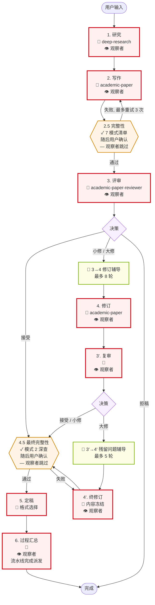
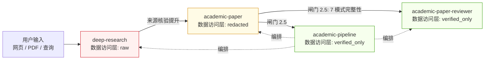
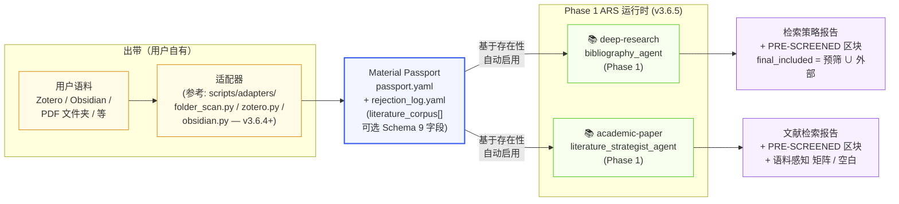
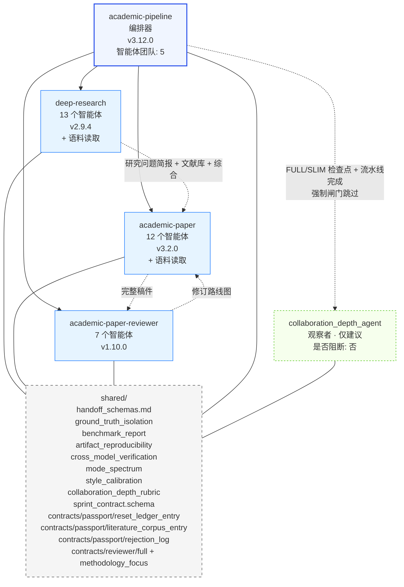

# ARS 流水线架构（v3.12.0）

跨阶段 × 技能 × 物料 × 闸门的完整流水线视图。每个完成的阶段都需要一个用户确认检查点（依据 `academic-pipeline/SKILL.md` 与 `pipeline_state_machine.md`）；下图在视觉上突出显示**决策密集型**检查点，以便于定位。2.5 与 4.5 处的阶段后确认检查点先由机器校验，再由用户确认——它们不会被跳过。

## 阅读指南

- **流程图**（§2）：宏观视图——哪个阶段衔接哪个、循环在哪里、闸门在哪里阻断。每个矩形的末尾都带有一个阶段后用户确认（为可读性而省略）；🧑 标记标注用户选择分支的决策密集型时刻。
- **矩阵**（§3）：唯一一处（阶段 × 技能 × 模式 × 数据层级 × 物料 × 智能体 × 闸门）同时并存的地方。当你要问"阶段 X 会发生什么"时用它。闸门列同时列出机器检查和结束该阶段的用户确认检查点。
- **数据访问流**（§4）与**技能依赖图**（§6）：正交视图，分别回答"谁能看到什么"与"谁依赖谁"。
- **文献语料流**（§5）：可选的 Material Passport `literature_corpus[]` 输入端口（v3.6.4）及其 Phase 1 消费者集成（v3.6.5）的生产者/消费者视图。
- **质量闸门**（§7）：聚焦阻断性检查的细览——既有机器强制也有人强制。
- **演进时间线**（§8）：解释架构为何演变成今天这样——每个版本要么新增一个"诚实性原语"，要么引入一项新契约。
- **技能模式**（§9）：在拼装流水线调用时作为参考。

仅看矩阵不足够：它隐藏了数据访问层级与技能依赖关系。仅看图也不足够：它隐藏了物料流与每阶段的智能体细节。两者合起来才是完整的架构。

## 1. 检查点一览

流水线共有**两类用户检查点**。两者都要求用户确认后才能推进；区别在于用户实际在做何种决策。

**决策密集型检查点**——用户选择一个分支或接受一个实质性决策：

| # | 阶段 | 用户决定的事项 |
|---|---|---|
| 🧑 1 | 1. RESEARCH | 研究问题简报 + 方法蓝图 |
| 🧑 2 | 2. WRITE | 起草前的提纲批准 |
| 🧑 3 | 3. REVIEW | 编辑决议（接受 / 小修 / 大修 / 拒稿） |
| 🧑 4 | 3 → 4 修订辅导 | 修订策略（最多 8 轮苏格拉底式提问；用户可跳过） |
| 🧑 5 | 4. REVISE | 确认修订变更 |
| 🧑 6 | 3'. RE-REVIEW | 复核决议 |
| 🧑 7 | 3' → 4' 残留问题辅导 | 残留问题的取舍权衡（最多 5 轮苏格拉底式提问；用户可跳过） |
| 🧑 8 | 4'. RE-REVISE | 内容冻结——不再启动新一轮评审 |
| 🧑 9 | 5. FINALIZE | 输出格式选择（MD / DOCX / LaTeX / PDF） |
| 🧑 10 | 6. PROCESS SUMMARY | 语言确认 + 协作质量复核 |

**阶段后确认检查点**——机器校验先跑；用户随后确认完整性报告再继续。这些也是用户把守的闸门（依 `pipeline_state_machine.md`——每个阶段都以 `[checkpoint]` 结束），但这里用户的决策是"确认自动化报告"而非"选择分支"：

| # | 阶段 | 运行内容 | 用户确认的内容 |
|---|---|---|---|
| ✓ 1 | 2.5 INTEGRITY | 7 模式失败清单（精确分类见 §3） | 完整性报告 PASS/FAIL + 任何 SUSPECTED 标记 |
| ✓ 2 | 4.5 FINAL INTEGRITY | 深度模式 2 检查，零容忍 | 最终完整性报告 PASS + 填充就绪的 Material Passport |

## 2. 流水线流程

**图例：**
- **红色实线（🧑）**= 决策密集型用户闸门——用户选择一个分支或批准一项实质性决策。
- **橙色实线（✓）**= 完整性闸门——机器校验先跑，用户随后确认报告。不跳过。
- **绿色**= 苏格拉底式辅导子阶段。用户可参与，也可说"直接修"跳过对话。
- **👁 observer**（v3.5.0）= `collaboration_depth_agent` 在每个 FULL/SLIM 检查点及流水线完成时派发。**永不阻断。** 仅作建议。强制完整性闸门（2.5 / 4.5）明确跳过 observer，以免合规检查被稀释。

## 3. 阶段 × 维度矩阵

| 阶段 | 技能 / 模式 | 数据层级 | 产出物料 | 核心智能体 | 闸门 / 检查点 |
|---|---|---|---|---|---|
| **1. RESEARCH** | `deep-research` v2.9.4（full / socratic / lit-review / systematic-review / fact-check / review / quick） | RAW | 研究问题简报；方法蓝图；带标注文献库（经 S2 核验）；综合报告；洞见集。**当 Material Passport 携带 `literature_corpus[]` 时，检索策略报告包含 PRE-SCREENED 区块（v3.6.5）** | research_question_agent；research_architect_agent；**📚 bibliography_agent（v3.6.5+ 语料读取者——语料优先 / 检索补缺口流程）**；source_verification_agent；synthesis_agent；meta_analysis_agent；editor_in_chief_agent；devils_advocate_agent；risk_of_bias_agent；ethics_review_agent；**🟦 socratic_mentor_agent（v3.5.1 阅读检查探针层，opt-in）**；report_compiler_agent；monitoring_agent（共 13 个智能体）；**👁 collaboration_depth_agent（v3.5.0，建议性）** | 🧑 **决策密集型检查点**：用户确认研究问题简报 + 方法。机器检查：S2 API Tier-0 核验（Levenshtein ≥ 0.70）；证据层级分级；DA 反从众（1-5 分，仅 ≥ 4 才让步）；**当语料存在时，启用语料优先流程含 4 条铁律 + F3/F4 来源报告（v3.6.5）**。👁 observer 在检查点后运行；永不阻断 |
| **2. WRITE** | `academic-paper` v3.2.0（full / plan / outline-only / lit-review / revision-coach / abstract-only / citation-check / disclosure / format-convert / revision） | REDACTED | 论文配置记录；提纲；论点图；草稿文本；双语摘要；插图 + 题注；引文清单。**当 Material Passport 携带 `literature_corpus[]` 时，文献检索报告含 PRE-SCREENED 区块（v3.6.5）**；合并后的 `final_included` 集汇入文献矩阵与研究空白识别 | 12 智能体流水线：intake_agent；**📚 literature_strategist_agent（v3.6.5+ 语料读取者——语料优先 / 检索补缺口流程）**；structure_architect_agent；argument_builder_agent；draft_writer_agent；citation_compliance_agent；abstract_bilingual_agent；peer_reviewer_agent；formatter_agent；socratic_mentor_agent；visualization_agent；revision_coach_agent；**👁 collaboration_depth_agent（v3.5.0，建议性）** | 🧑 **决策密集型检查点**：提纲在起草前获批。机器检查：防泄漏协议（无依据的填充 → `[MATERIAL GAP]`）；VLM 插图核验（10 项 APA 清单，最多 2 次修正）；相对用户语声的风格校准；阶段 2 并行化（提纲后 Phase 1 + 可视化）；**当语料存在时，启用语料优先流程含 4 条铁律 + F3/F4 来源报告（v3.6.5）**。👁 observer 在检查点后运行；永不阻断 |
| **2.5 INTEGRITY** | `academic-pipeline` v3.12.0（gate） | VERIFIED_ONLY | Material Passport（Schema 9，必填）+ `repro_lock`（v3.3.5，需声明——填充或 `null`）；论断核验报告（评审前抽样：30% 的论断，最少 10 条——依 `claim_verification_protocol.md`）；数据来源审计 | integrity_verification_agent；state_tracker_agent；pipeline_orchestrator_agent。**👁 collaboration_depth_agent：跳过（强制闸门——明确避免 observer 稀释）** | ✓ **完整性闸门** + 用户确认。7 模式 AI 失败清单（Lu 2026，标准顺序见 `ai_research_failure_modes.md`）：**M1** 逃过 AI 自评的实现 bug；**M2** 编造引文；**M3** 编造实验结果；**M4** 依赖捷径；**M5** 把实现 bug 重新包装为新洞见；**M6** 方法造假；**M7** 早期流水线阶段框锁。评审前论断抽样模式。FAIL → 修复 + 重新核验（最多 3 轮） |
| **3. REVIEW** | `academic-paper-reviewer` v1.10.0（full / guided / quick / methodology-focus / calibration） | VERIFIED_ONLY | **首轮评审包**（依 `academic-paper-reviewer/SKILL.md`）：5 份评审报告（主编 + R1 方法学 + R2 领域 + R3 跨学科 + 魔鬼代言人）+ 编辑决议（接受 / 小修 / 大修 / 拒稿）+ 修订路线图。**v3.6.2 Schema 13 Sprint Contract（`shared/sprint_contract.schema.json`）对 `full` 与 `methodology-focus` 模式为必填**（其余模式保留 v3.6.2 前行为） | field_analyst_agent（自动侦测领域，配置 3 个领域自适应评审者）；eic_agent；methodology_reviewer_agent；domain_reviewer_agent；perspective_reviewer_agent；devils_advocate_reviewer_agent；**🔒 editorial_synthesizer_agent（v3.6.2 三步机械协议 + 禁用操作清单）**（共 7 个智能体）；**👁 collaboration_depth_agent（v3.5.0，建议性）** | 🧑 **决策密集型检查点**：用户审阅编辑决议。机器检查：让步阈值协议（DA 反驳 1-5 分，< 4 不让步）；攻击强度跨修订保留；跨模型 DA 批评（可选，`ARS_CROSS_MODEL` 环境）；只读约束（不得新增论断）。**v3.6.2 Sprint Contract 两阶段协议**：每位评审者先盲跑 Phase 1（只看元数据，提交评分计划，论文内容不可见），再通过 `<phase1_output>` 数据分隔符在 Phase 2 看到论文；synthesizer 跑三步机械协议（构造矩阵 → 用面板相对量词评估 → 按严重性归类优先级）。由 `scripts/check_sprint_contract.py` 校验。👁 observer 在检查点后运行；永不阻断 |
| **3 → 4 修订辅导** | `academic-paper-reviewer`（主编苏格拉底子阶段） | VERIFIED_ONLY | 修订策略对话（非向前传递的物料；流入阶段 4 的修订计划） | eic_agent | 🧑 **决策密集型检查点**：与主编的苏格拉底式对话（最多 8 轮）。用户可说"直接帮我修"跳过。来源：`two_stage_review_protocol.md` |
| **4. REVISE** | `academic-paper` v3.2.0（revision / revision-coach） | REDACTED | 逐条回复表；修订草稿；Delta 报告（改了什么 + 为什么） | revision_coach_agent（v3.3 苏格拉底模式）；draft_writer_agent（再入）；argument_builder_agent（如涉及结构）；**👁 collaboration_depth_agent（v3.5.0，建议性）** | 🧑 **决策密集型检查点**：用户确认变更。机器检查：每条评分维度跟踪得分轨迹（v3.3）——任一维度退化的修订会被标记。👁 observer 在检查点后运行；永不阻断 |
| **3'. RE-REVIEW** | `academic-paper-reviewer` v1.10.0（re-review） | VERIFIED_ONLY | **复核包**（依 reviewer SKILL.md 的 re-review 模式规范）：修订响应清单 + 残留问题清单 + 新决议（接受 / 小修 / 大修）+ **R&R 追溯矩阵（Schema 11）**，含"作者论断"与"是否已核验"两列 | **精简复核团队**：field_analyst_agent + eic_agent + editorial_synthesizer_agent（3 个智能体——不是完整的阶段 3 评审团）；**👁 collaboration_depth_agent（v3.5.0，建议性）** | 🧑 **决策密集型检查点**：用户审阅复核决议。硬上限：**最多 1 轮 RE-REVISE；阶段 4 + 4' 合计 2 轮修订循环**。3' 出现大修 → 残留问题辅导 → 阶段 4'。👁 observer 在检查点后运行；永不阻断 |
| **3' → 4' 残留问题辅导** | `academic-paper-reviewer`（主编苏格拉底子阶段） | VERIFIED_ONLY | 残留问题对话 | eic_agent | 🧑 **决策密集型检查点**：就残留问题的取舍进行苏格拉底式对话（最多 5 轮）。用户可跳过。来源：`two_stage_review_protocol.md` |
| **4'. RE-REVISE** | `academic-paper` v3.2.0（revision） | REDACTED | 最终修订稿（终态；进入 4.5） | draft_writer_agent；revision_coach_agent；**👁 collaboration_depth_agent（v3.5.0，建议性）** | 🧑 **决策密集型检查点**：用户确认内容冻结。不允许再启动新一轮评审。👁 observer 在检查点后运行；永不阻断 |
| **4.5 FINAL INTEGRITY** | `academic-pipeline` v3.12.0（gate） | VERIFIED_ONLY | 更新后的 Material Passport（`verification_status: VERIFIED`）+ `repro_lock` 已声明——填充或显式 `null`（诚实退出）；论断核验报告（**终查模式：100% 论断**，依 `claim_verification_protocol.md`） | integrity_verification_agent（更深重跑 7 模式）；state_tracker_agent。**👁 collaboration_depth_agent：跳过（强制闸门——明确避免 observer 稀释）** | ✓ **完整性闸门** + 用户确认。**7 模式重跑零容忍；不允许跳过。** 凡在 2.5 仍处于 SUSPECTED 的模式，到 4.5 必须为 CLEAR 或被用户覆盖。`repro_lock` 在运行时**不被**完整性闸门读取（依 `artifact_reproducibility_pattern.md`）；若已填充，`stochasticity_declaration` 必须逐字一致，由独立脚本 `check_repro_lock.py` 校验——这是事后文档，不是运行时阻断 |
| **4→5 CLAIM-AUDIT**（v3.8，经 `ARS_CLAIM_AUDIT=1` 开启） | `academic-pipeline` v3.12.0（gate） | VERIFIED_ONLY | `claim_audit_results[]` + `claim_drifts[]` + `uncited_assertions[]` + `constraint_violations[]` + `audit_sampling_summaries[]` 汇总；读取 `claim_intent_manifests[]`（写作侧预提交基线）。输出 5 类 HIGH-WARN 标注，供阶段 5 formatter 的 REFUSE 规则 6-10 消费 | claim_ref_alignment_audit_agent（阶段 4→5 派发槽，在 v3.7.1 cite finalizer 之后、formatter 硬闸门之前） | ✓ **审计闸门**（v3.8.0 默认关闭）。对每条引文用 LLM-as-judge 比对检索片段；8 行 finalizer 矩阵通过 `ref_retrieval_method` 区分付费墙（LOW-WARN） / 编造（HIGH-WARN） / 无锚（HIGH-WARN） / 审计工具失败（MED-WARN）。校准 runner（`scripts/test_claim_audit_calibration.py`）以出厂 20 元组黄金集进行门槛校验：FNR<0.15 且 FPR<0.10。规范：`docs/design/2026-05-15-issue-103-claim-alignment-audit-spec.md` |
| **5. FINALIZE** | `academic-paper` v3.2.0（format-convert / disclosure） | VERIFIED_ONLY | 可发表版 MD；DOCX（Pandoc，若可用）；LaTeX（用户确认）；PDF（tectonic）；AI 披露声明（按投稿场景） | formatter_agent | 🧑 **决策密集型检查点**：用户在渲染前选择格式。披露声明须匹配投稿场景（ICLR / NeurIPS / Nature / Science / ACL / EMNLP）。**v3.8 终态硬闸门（formatter_agent REFUSE 规则 6-10）**：当上游设置了 `ARS_CLAIM_AUDIT=1` 时，遇到任何未解决的 `[HIGH-WARN-CLAIM-NOT-SUPPORTED]` / `[HIGH-WARN-NEGATIVE-CONSTRAINT-VIOLATION]` / `[HIGH-WARN-FABRICATED-REFERENCE]` / `[HIGH-WARN-CLAIM-AUDIT-ANCHORLESS]` / `[HIGH-WARN-CONSTRAINT-VIOLATION-UNCITED]` 标注即拒绝输出。**v3.10 规则 11**：在严格 `terminal_policies` 模式下，遇到任何 `severity=HIGH-BLOCK` 终态策略令牌即拒绝（通用；由 finalizer 在严格 `terminal_policies` 模式下并发出）。**v3.11 规则 12（#182）**：仅在 `terminal_policies.citation_existence == strict` 时，对 `lookup_verified == false` 的引文存在性行拒绝——默认建议性可通过（可 `/ars-mark-read` 确认）；ID 键控的 `false` 不会在仅标题未命中的 `unresolvable` 引文上触发 |
| **6. PROCESS SUMMARY** | `academic-pipeline` v3.12.0 | VERIFIED_ONLY | 论文创作过程记录（MD + PDF）；AI 自省报告（让步率、迎奉风险、健康告警、失败模式审计日志）；得分轨迹可视化；**协作深度章节（v3.5.0）**，汇总 `collaboration_depth_history[]` 中各检查点的 observer 报告 | state_tracker_agent；pipeline_orchestrator_agent；**👁 collaboration_depth_agent（v3.5.0，流水线完成派发——最终建议性报告）** | 🧑 **决策密集型检查点**：与用户确认语言。评估协作质量。同行评审发表后的审后审计报告（如有）。👁 observer 跑最终的流水线完成派发；永不阻断 |

## 4. 数据访问层级流（v3.3.2+）

规则（依 `shared/ground_truth_isolation_pattern.md`）：

- `data_access_level` 是一种**声明式**标注，不是运行时强制权限系统。CI lint `scripts/check_data_access_level.py` 仅确认每个 `SKILL.md` 携带合法取值；不在运行时检查上下文窗口。
- `raw` 技能消费第一层数据（任意，可能对抗性）。
- `redacted` 技能操作脱敏物料，不再吸收新的原始数据。
- `verified_only` 技能仅在上游完整性闸门通过后运行。
- 评审侧**可私有持有评分准则**——关键保证是：评分准则 / 黄金标签内容不得出现在生成候选的智能体的上下文中。校准黄金集由人类研究者在运行时提供，不随仓库打包。
- 阶段 2.5 与阶段 4.5（以及每个闸门处的用户评审）才是真正的强制点。此模式文档解释了让那些闸门富有意义的数据流结构；它本身不是运行时锁。

## 5. Material Passport `literature_corpus[]` 流（v3.6.4 输入端口 + v3.6.5 消费者）

Material Passport 的 `literature_corpus[]` 是一个**可选**的 Schema 9 输入端口，用于用户自管的文献。生产者（出带，在 ARS 会话之前）与消费者（运行时的 Phase 1 文献智能体）位于 passport 的两侧。

**生产侧（v3.6.4 输入端口）。** 适配器在出带运行——在 ARS 会话之前，而非会话期间。它们读取用户语料来源，生成填充了 `literature_corpus[]` 的 `passport.yaml`，并同时生成一份 `rejection_log.yaml`（总是发出；无驳回时为空）。三个参考 Python 适配器随 `scripts/adapters/{folder_scan,zotero,obsidian}.py` 出货；用户可依 [`academic-pipeline/references/adapters/overview.md`](../academic-pipeline/references/adapters/overview.md) 为非参考来源自行编写适配器。schema 由 `scripts/check_literature_corpus_schema.py` 校验。

**消费侧（v3.6.5）。** 两个 Phase 1 文献智能体通过**语料优先、检索补缺口**流程读取 `literature_corpus[]`——`deep-research/agents/bibliography_agent.md` 与 `academic-paper/agents/literature_strategist_agent.md`。该流程基于存在性触发：当 passport 携带非空的 `literature_corpus[]` 且能干净解析时自动启用。当语料缺失、为空或未通过最小形状检查时，每个消费者按其既有的"仅外部数据库"流程原样运行（对失败情况遵循铁律 4 的优雅回退）。

**共享五步流程。** 第 0 步最小形状检查 → 第 1 步按当前研究问题对语料预筛 → 第 2 步检索补缺口（按 `uncovered_topics` × `user_corpus_only` 四象限派发） → 第 3 步合并入 `final_included` → 第 4 步发出含 PRE-SCREENED 区块的检索策略报告。`final_included` 保持中性——文献库条目不带来源标签，文献矩阵中无来源列。

**四条铁律**约束每个消费者：

1. **同一标准。** 对语料条目与外部数据库结果套用相同的纳入 / 排除标准。无例外。
2. **不静默跳过。** 任何被跳过的语料条目都记录在 PRE-SCREENED 区块的 skipped 子段并附理由。静默丢弃条目是提示层违规。
3. **不改语料。** 消费者智能体永不修改、回填或在 `literature_corpus[]` 中派生新内容。只读。
4. **解析失败优雅回退。** 消费者智能体不复验 schema、不在运行时解析 JSON Schema、不解引用 `source_pointer` URI。当语料无法解析时，发出 `[CORPUS PARSE FAILURE: <原因>]` 并回退到仅外部数据库流程。

**PRE-SCREENED 可复现性区块。** 位于每个消费者报告检索策略小节内、紧贴既有 `Databases` 行之前。逐一列出纳入 / 排除 / 跳过的 citation_keys 及理由；语料非空但经筛选无条目存活时带 F0 零命中记号；对 `obtained_via`（适配器来源）与 `obtained_at`（快照日期）带 F4a–F4f 来源报告，覆盖全量 / 部分 / 未声明 / 大范围扩散各子情形。CI lint `scripts/check_corpus_consumer_protocol.py` 以清单驱动的消费者列表（`scripts/corpus_consumer_manifest.json`）和元组匹配闭集状态机强制 L1-L9 共 9 个不变量。

**v3.6.5 范围外。** `citation_compliance_agent` 的语料读取被推迟（目标版本待定，v3.8 之后）。`source_pointer` URI 解引用与来源核验仍是 `source_verification_agent` 未来的关注点。schema 与 v3.6.4 相比未变——既有用户适配器无需改动即可工作。

权威参考：[`academic-pipeline/references/literature_corpus_consumers.md`](../academic-pipeline/references/literature_corpus_consumers.md)（消费者协议）+ [`academic-pipeline/references/adapters/overview.md`](../academic-pipeline/references/adapters/overview.md)（适配器契约）+ [`docs/design/2026-04-26-ars-v3.6.5-consumer-integration-design.md`](design/2026-04-26-ars-v3.6.5-consumer-integration-design.md)（消费者设计）。

## 6. 技能依赖图

## 7. 质量闸门

两类闸门：**🧑 决策密集型**（用户选择分支或批准实质决策）与 **✓ 完整性**（机器校验 + 用户确认）。纯机器强制 🤖 的 lint 检查在 CI 中执行。

| 闸门 | 类别 | 阶段 | 阻断推进的判定 | 失败处理 |
|---|---|---|---|---|
| 研究问题 + 方法学确认 | 🧑 | 1 | 用户未批准研究问题简报与方法蓝图 | 修订并重新提交 |
| S2 API 核验 | 🤖 | 1 | 引文不在 Semantic Scholar 中；标题 Levenshtein < 0.70 | 标记；用户决定删除或重引 |
| 提纲批准 | 🧑 | 2 | 用户未批准提纲 | 修订并重新提交 |
| 防泄漏（v3.3） | 🤖 | 2 | 草稿含未受会话物料支撑的参数式填充 | 标 `[MATERIAL GAP]`；用户补料或接受空缺 |
| VLM 插图核验（v3.3） | 🤖 | 2 | 渲染插图未通过 10 项 APA 7.0 清单 | 最多 2 次修正迭代 |
| 阶段 2.5 完整性 + 确认 | ✓ | 2.5 | 7 模式清单任一模式 SUSPECTED，或模式 1/3/5/6 证据不足，或用户未确认报告 | 修复 + 重新核验（最多 3 轮）；或用户带理由覆盖（记入日志） |
| 主编决议评审 | 🧑 | 3 | 用户未评审决议信 | 呈交决议；等待用户 |
| 让步阈值 | 🤖 | 3 | DA 反驳评分 < 4/5 | 不让步；框锁探测器运行 |
| 修订辅导 | 🧑 | 3→4 | 用户未参与或未明确跳过（最多 8 轮） | 用户可说"直接帮我修"跳过 |
| 修订确认 | 🧑 | 4 | 用户未确认变更 | 修订；重新提交 |
| 修订循环上限 | 🤖 | 4 / 3' / 4' | 已用完 2 轮修订循环 | 强制推进至阶段 4.5 |
| 残留问题辅导 | 🧑 | 3'→4' | 用户未参与或未明确跳过（最多 5 轮） | 用户可说"直接帮我修"跳过 |
| 内容冻结确认 | 🧑 | 4' | 用户未确认冻结 | 等待用户；不允许再启动新一轮评审 |
| 阶段 4.5 终查 + 确认 | ✓ | 4.5 | 更深 7 模式重跑出现任一问题；或自 2.5 以来仍 SUSPECTED 且未解决 | 零容忍；不可跳过；修复 + 重新核验 |
| 格式选择 | 🧑 | 5 | 用户未选择输出格式 | 等待用户选格式 |
| 披露检查 | 🤖 | 5 | 缺少场景特定 AI 披露或形式有误 | 阻止渲染直至修复 |
| `repro_lock`（v3.3.5） | 🤖（独立） | — | v3.3.5+ Material Passport 必须含 `repro_lock` 键；取值要么是已填充区块，要么是显式 `null`（诚实退出）。已填充区块由 `check_repro_lock.py` 校验。依 `artifact_reproducibility_pattern.md`：默认**不**接入 CI lint 套件，运行时**不**被阶段 2.5 / 4.5 完整性闸门读取——这是事后文档，不是流水线阻断 | 按需运行 `check_repro_lock.py <passport>` |
| 语言 + 协作复核 | 🧑 | 6 | 用户未确认输出语言 / 未评审自省 | 等待用户 |
| `benchmark_report`（v3.3.5，外部） | 🤖 | — | 发表基准测试时未作诚实披露 | 用户在发表前运行 `check_benchmark_report.py` |
| 协作深度 Observer（v3.5.0） | 🤖 observer | 每个 FULL/SLIM 检查点 + 流水线完成 | **永不阻断。** 仅作建议。依 `shared/collaboration_depth_rubric.md` 沿 4 个维度（委派强度 / 认知警觉 / 认知重分配 / 区域分类）对用户-AI 协作模式打分。在检查点展示中注入命名段落，并在过程记录中注入一章节。强制完整性闸门（2.5 / 4.5）**不**调用 observer。 | 不适用——输出为建议；用户的 `Ready to proceed?` 提示保持不变 |
| 阅读检查探针（v3.5.1，opt-in） | 🤖（导师子层） | 阶段 1（苏格拉底导师会话） | 经 `ARS_SOCRATIC_READING_PROBE=1` 开启。仅目标导向意图；每会话至多触发一次，前提是用户引用了某篇具体论文。拒绝计入日志但不惩罚。结果内联于研究计划摘要；并带入阶段 6 的 AI 自省报告。 | 不适用——非阻断；标志关闭时按 v3.5.1 前行为逐字节保留 |
| Sprint Contract 硬闸门（v3.6.2） | 🤖 + 🧑 | 3（REVIEW） | 每位评审者在看到论文前（Phase 1 仅元数据）须产出一份 Schema 13 sprint contract（`shared/sprint_contract.schema.json`）。Phase 2 看到论文的评审通过 `<phase1_output>` 数据分隔符消费已提交契约。`editorial_synthesizer_agent` 跑三步机械协议，配禁用操作清单。由 `scripts/check_sprint_contract.py` 校验（结构不变量 + 9 条软警告）。模板：`shared/contracts/reviewer/full.json`（5 人面板）+ `methodology_focus.json`（2 人面板）；保留模式（`re-review` / `calibration` / `guided` / `quick`）沿用 v3.6.2 前行为。 | synthesizer 拒绝事后改评分准则；用户在评审日志中可看到契约的预提交 |
| Passport 重置边界（v3.6.3，opt-in） | 🤖（编排器） | FULL 检查点 | 经 `ARS_PASSPORT_RESET=1` 开启。把每个 FULL 检查点提升为上下文重置边界。该标志在 `systematic-review` 模式下为强制；其他模式把重置视为标志门控的默认。`academic-pipeline` 新增 `resume_from_passport=<hash>` 模式，让用户可在全新会话中仅凭 Material Passport 账本恢复。Schema 9 `reset_boundary[]` 只追加账本，含 `kind: boundary` 与 `kind: resume` 两种条目类型；哈希采用 JSON Canonical Form + SHA-256 + 自引用安全的规范占位符。并发契约：POSIX `fcntl.flock LOCK_EX` + 有界超时 ≤60s + 非 POSIX 平台严格报错。权威协议：[`academic-pipeline/references/passport_as_reset_boundary.md`](../academic-pipeline/references/passport_as_reset_boundary.md)。由 `scripts/check_passport_reset_contract.py` 校验。 | 标志关闭时按 v3.6.3 前的延续行为逐字节保留 |
| 语料消费者协议（v3.6.5） | 🤖 + Phase 1 智能体 | 1 / 2（当 `literature_corpus[]` 存在时） | 当 Material Passport 携带非空 `literature_corpus[]` 且能干净解析时，基于存在性自动启用。四条铁律（同一标准 / 不静默跳过 / 不改语料 / 解析失败优雅回退）。检索策略报告中含 PRE-SCREENED 可复现性区块（F3 零命中 + F4a–F4f 来源）。由 `scripts/check_corpus_consumer_protocol.py` 校验（9 个不变量 L1-L9 + 清单驱动的消费者列表）。 | 解析失败 → 发出 `[CORPUS PARSE FAILURE: <原因>]` 并回退到仅外部数据库流程（铁律 4） |

## 8. ARS 演进时间线

```mermaid
timeline
    title ARS 演进时间线
    v3.3 : Semantic Scholar API 核验
         : 防泄漏协议
         : VLM 插图核验
         : 得分轨迹跟踪
         : 阶段 2 并行化
    v3.3.1-v3.3.6 : 公开契约漂移修复 + check_spec_consistency.py
                   : data_access_level + task_type frontmatter
                   : Lint 加固 + ground_truth_isolation_pattern
                   : benchmark_report.schema.json + Material Passport 上的 repro_lock
                   : README 变更摘要同步 + CI 校验
    v3.4.0 : compliance_agent (PRISMA-trAIce + RAISE)
           : Schema 12 compliance_report + compliance_history[]
           : 3 轮覆盖阶梯 + disclosure_addendum
           : 新鲜度检查（180 天阈值）
    v3.5.0 : collaboration_depth_agent（建议性观察者）
           : shared/collaboration_depth_rubric.md（Wang & Zhang 2026）
           : dialogue_log_ref + collaboration_depth_history[]
           : 短阶段守卫 + ARS_CROSS_MODEL_SAMPLE_INTERVAL
    v3.5.1 : 苏格拉底阅读检查探针（经 ARS_SOCRATIC_READING_PROBE 开启）
           : 仅目标导向意图, 每会话至多一次
           : 拒绝计入日志但不惩罚
    v3.6.2 : 面向评审者的 Schema 13 Sprint Contract 硬闸门
           : 两阶段协议（论文不可见的 Phase 1 + 论文可见的 Phase 2）
           : editorial_synthesizer 三步机械协议 + 禁用操作清单
           : full.json（5 人面板）+ methodology_focus.json（2 人面板）模板
    v3.6.3 : 可选 passport 重置边界 (ARS_PASSPORT_RESET=1)
           : resume_from_passport 模式 + Schema 9 reset_boundary[] 账本
           : JSON Canonical Form + SHA-256 哈希 + 规范占位符
           : POSIX fcntl.flock LOCK_EX 并发契约
    v3.6.4 : Material Passport literature_corpus[] 输入端口（Schema 9 可选）
           : 语言无关的适配器契约 + 3 个参考 Python 适配器
           : rejection_log.yaml 契约（闭枚举, 总是发出）
           : check_literature_corpus_schema.py + sync_adapter_docs.py CI lint
    v3.6.5 : Phase 1 中的 literature_corpus[] 消费者集成
           : bibliography_agent + literature_strategist_agent 语料优先流程
           : 4 条铁律 + PRE-SCREENED 区块 + F3 零命中 + F4 来源
           : check_corpus_consumer_protocol.py（9 个不变量, 清单驱动）
    v3.6.7 : 下游智能体 PATTERN PROTECTION（Step 1+2）
           : synthesis_agent A1-A5 + research_architect_agent B1-B5 + report_compiler_agent C1-C3
           : 4 份参考术语表（IRB / 心理测量 / 对冲 / 字数）
           : check_v3_6_7_pattern_protection.py（29 项变异测试套件）
    v3.6.8 : 生成器-评估器契约闸门（v3.6.6 规范出货, 命名偏移）
           : Schema 13.1 + writer_full / evaluator_full 模板
           : academic-paper full 模式下的两阶段编排（Phase 4a/4b + 6a/6b）
           : check_sprint_contract.py 中的 SC-* 模式门控
    v3.7.0 : Claude Code 插件打包
           : .claude-plugin/{plugin,marketplace}.json + skills/ 符号链接
           : 10 个斜杠命令（commands/ars-*.md, 模型固定 opus/sonnet, 不含 haiku）
           : 3 个插件智能体（agents/, 符号链接至 v3.6.7 加固源, model: inherit）
           : SessionStart 公告钩子（hooks/hooks.json + announce-ars-loaded.sh）
    v3.7.3 : L3 定位符基础设施（论断忠实性——上半场）
           : 三层引文发射（synthesis / draft_writer / report_compiler）
           : 每个 <!--ref:slug--> 上的 <!--anchor:kind:value-->（quote / page / section / paragraph / none）
           : contamination_signals 建议（preprint_post_llm_inflection + semantic_scholar_unmatched）
           : check_v3_7_3_three_layer_citation.py + finalizer 5 单元, 优先级为零的 NO-LOCATOR
    v3.8.0 : L3 论断忠实性审计（下半场——与 v3.7.3 配对）
           : claim_ref_alignment_audit_agent（经 ARS_CLAIM_AUDIT=1 开启, 默认关闭）
           : 5 个新 passport schema（claim_audit_result / claim_intent_manifest / claim_drift / uncited_assertion / constraint_violation）
           : 8 行 finalizer 矩阵 + 5 个新 HIGH-WARN 类别（formatter REFUSE 规则 6-10）
           : 校准 runner（20 元组黄金集, FNR<0.15 + FPR<0.10 验收门槛）
           : check_claim_audit_consistency.py（38 个不变量）+ check_v3_8_annotation_literal_sync.py
    v3.8.1 : claim_audit lint 加固（#119 + #120 4×P2 关闭）
    v3.8.2 : uncited audit_tool_failure 暴露（#118）
    v3.9.0 : 跨索引三角化测量（S2 + OpenAlex + Crossref, 4 级建议）
           : openalex_unmatched + crossref_unmatched 污染信号
           : 4 级建议（CONTAMINATED-COVERAGE-NOISE / PARTIAL-UNMATCH / TRIANGULATION-UNMATCHED）
    v3.9.1 : 客户端加固——封装 response-read 失败（#129）+ manifest_id 守卫（#130）
    v3.9.2 : Phase 范围膨胀热修（#133）
           : 跨 22 个单阶段智能体的 phase 边界阻断
           : 针对歧义跨阶段材料的意图澄清闸门
    v3.9.3 : 内务整理——共享客户端工具 + 去重解析器（#128）
           : 兄弟优先的双路径导入约定
           : time.monotonic 标准化
    v3.9.4 : 时间核验建议层（#135）
           : M1 timeline_extraction_agent（Phase 2 兄弟）
           : M2 Phase 4→5 边界处的 5 遍核验器（P1 算术 / P2 时代错位 / P3 比较器 / P4 因果 / P5 指示)
           : M3 compiler+writer 中的时间完整性铁律
           : M6 第一方 Crossref + pdftotext 核验
           : F2 不变量——bibliography_agent.md 未修改（sha256 守卫）
    v3.9.4.1 : 出货后热修（4 项 codex 发现: P1×2 + P2×2）
              : audit() 将 citation_provenance 贯通至 P2/P4（规范 §3.4 承诺）
              : _date_to_interval 解析所有 schema 合法日期形态（YYYY-MM + 区间）
              : P4 绑定直接日期捕获（不仅是 ref 标记）
              : citation_provenance.schema.json confidence:high 要求必填
    v3.9.4.2 : CI 纪律加固（PR #149 + #153 + #157; codex 出货后 4 项 P2 中的 3 项）
              : F1 harness-retirement-monthly 为计划运行添加 GH_REPO
              : F2 release-cooldown 将 PREV_TAG 查找限定为 v* 标签
              : F3 release-cooldown 读取附注标签主题 + 接受热修拼写
              : [skip-cooldown] 覆盖现从提交消息和标签消息两处读取
              : F4 test-count-monotonic 加固撤回（暴露 #154; 重试 #155）
    v3.10.0 : 三角化终态策略层（#127 PR-B, 可选严格）
             : Kong et al. 调研采纳（承诺账本 #256/#266/#268/#269; 领域画像 #259）
             : 通用化评估黄金集 + ranking-lift CI 闸门（#184）
             : scoped-write 守卫 MVP——23 个单阶段智能体上的 PreToolUse 栅栏（#134）
    v3.11.0 : 确定性引文核验闸门（#182）
             : arXiv 解析器 + 四索引污染矩阵 k=0..4（Delta 1）
             : 持久化 SQLite 核验缓存 + /ars-cache-invalidate（Delta 2）
             : citation_existence 终态策略——默认建议, 可选严格（Delta 3 / C-V6）
             : 统一 lookup_verified 摘要 + 独立 verification_gate API（Delta 4+5）
```

## 9. 技能模式

| 技能 | 模式 |
|---|---|
| `deep-research` v2.9.4 | full, quick, socratic, review, lit-review, fact-check, systematic-review（7） |
| `academic-paper` v3.2.0 | full, plan, outline-only, revision, revision-coach, abstract-only, lit-review, format-convert, citation-check, disclosure（10） |
| `academic-paper-reviewer` v1.10.0 | full, re-review, quick, methodology-focus, guided, calibration（6） |
| `academic-pipeline` v3.12.0 | orchestrator（委派至子技能模式）+ `resume_from_passport=<hash>`（v3.6.3——从某个 Material Passport 重置边界恢复此前流水线运行；调用时无需标志，但产生该运行的会话须设置 `ARS_PASSPORT_RESET=1` 才会发出边界条目）+ `ARS_CLAIM_AUDIT=1`（v3.8——可选的阶段 4→5 L3 论断忠实性审计闸门；默认关闭）+ v3.9.4 时间核验建议层（M1 timeline_extraction_agent + 阶段 4→5 处的 M2 五遍核验器 + M3 IRON RULE + M6 第一方 Crossref/pdftotext） |